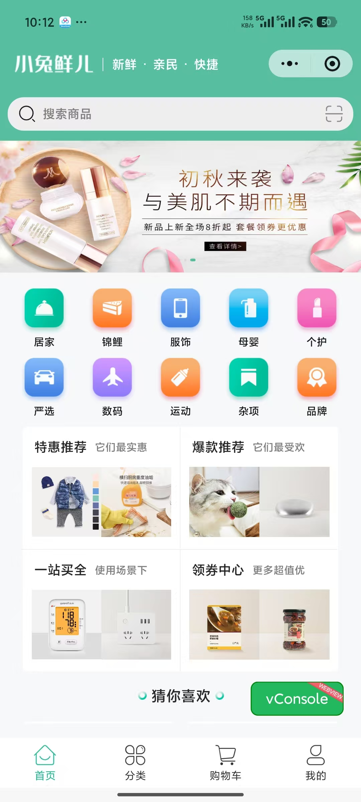
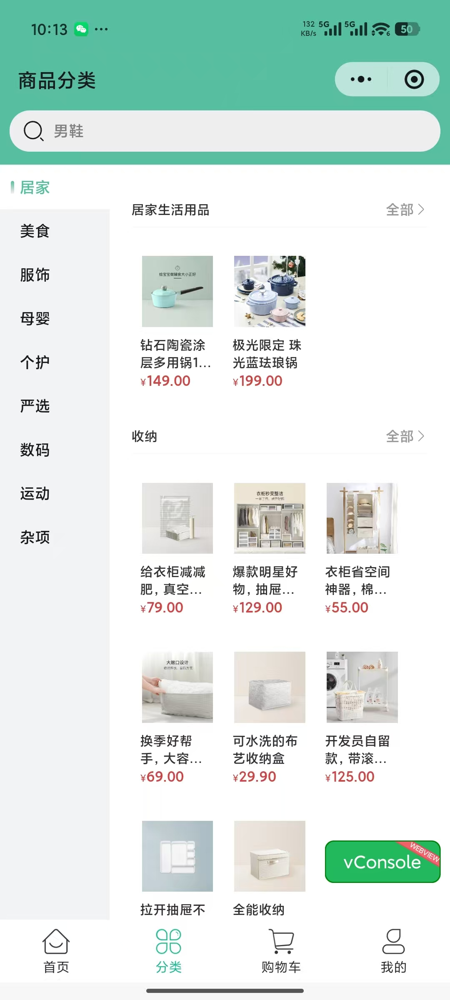
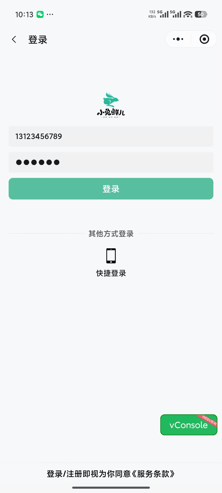
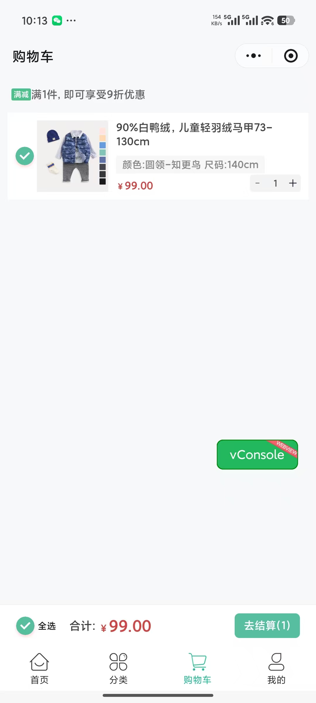
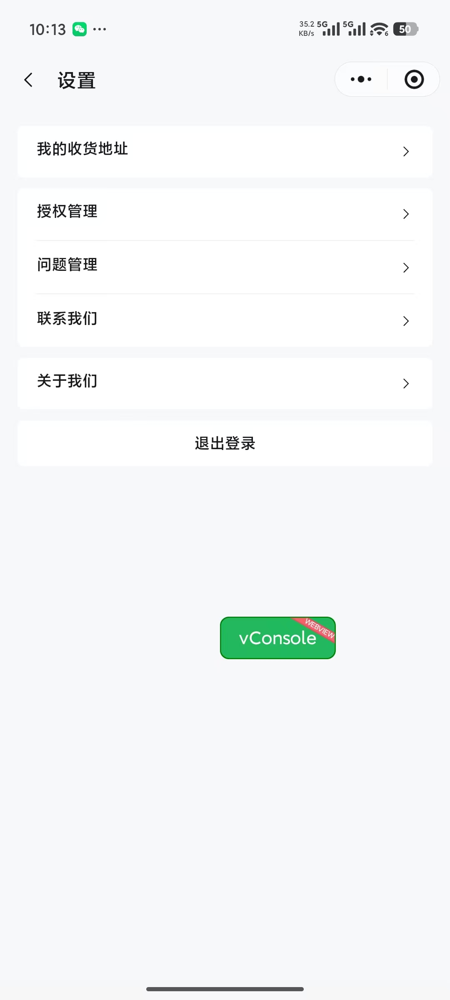
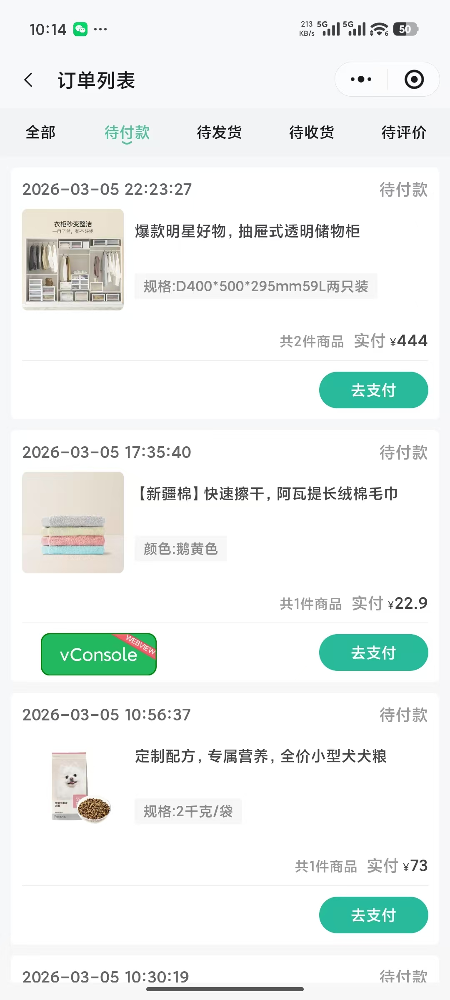
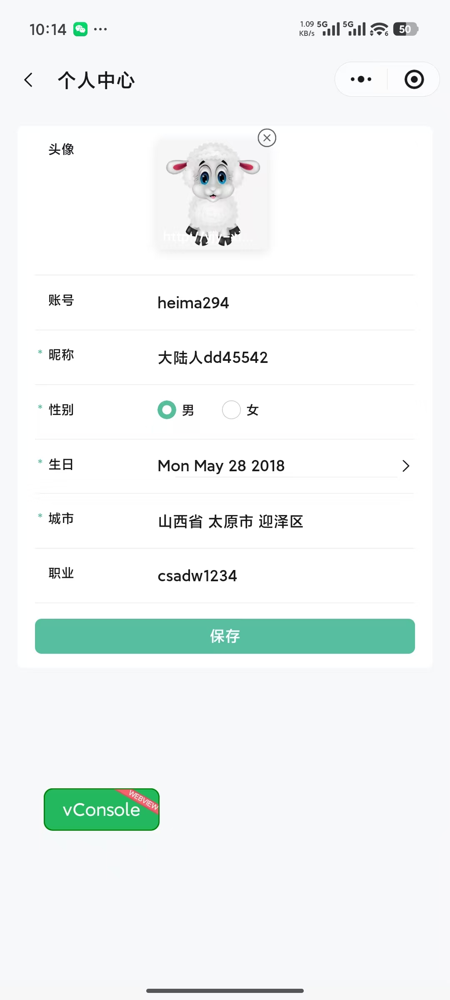
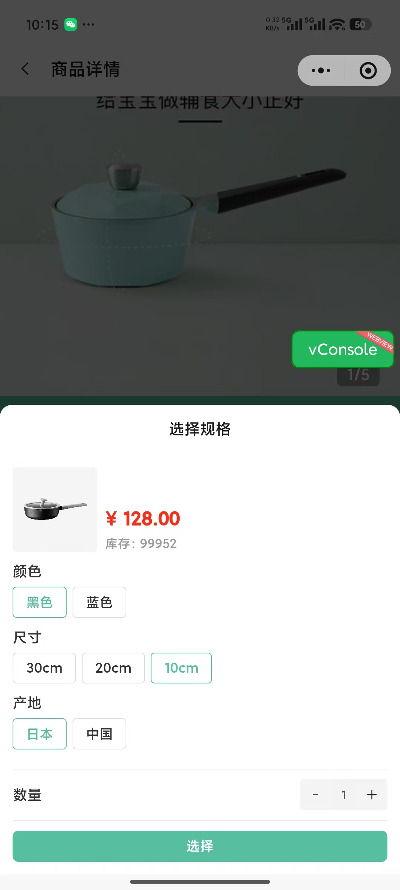
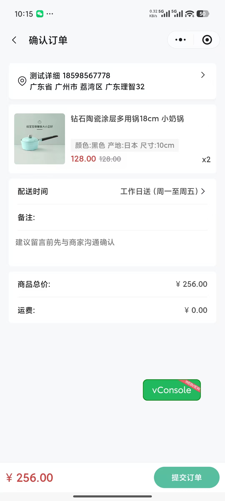
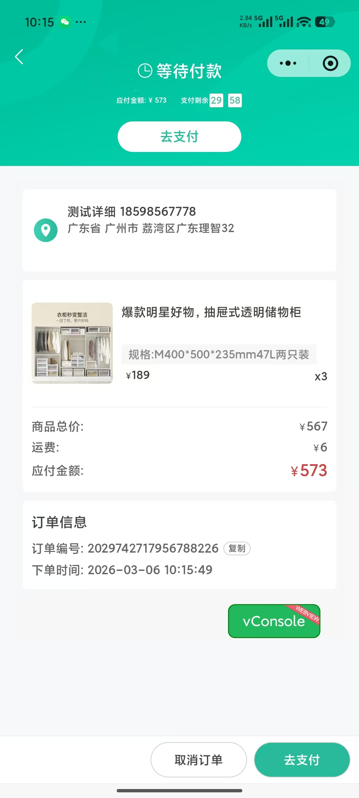

## 项目简介

参考 **B 站黑马程序员** uni+vue3 **小兔鲜儿电商项目** 使用 Taro + React 进行构建 署于微信小程序平台与 H5 端。素材及接口均使用其提供的资源

### 技术栈

- 前端框架：[Taro](https://docs.taro.zone/docs/)
- 状态管理：[redux + @rematch/core](https://cn.redux.js.org/)
- 组件库：[NutUi-React-Taro](https://nutui.jd.com/taro/react/3x/#/zh-CN/guide/intro-react)

### 项目功能

- 首页：展示商品分类、轮播图、最新商品等
- 分类页：展示商品分类，点击分类可查看该分类下的商品
- 商品详情页：展示商品详细信息，包括图片、描述、价格、库存等
- 购物车：展示用户添加到购物车的商品，可修改商品数量、删除商品等
- 订单页：展示用户订单信息，包括订单状态、订单金额、订单商品等
- 用户中心：展示用户个人信息，包括用户头像、用户名、手机号等
- 登录页：用户登录，支持账号密码登录、手机号登录、微信登录等
- 注册页：用户注册，填写用户名、手机号、密码等信息进行注册
- 地址管理页：展示用户保存的地址信息，可添加、修改、删除地址等

### 项目截图

<table>
  <tr>
    <td></td>
    <td></td>
    <td></td>
    <td></td>
    <td></td>
    <td></td>
  </tr>
  <tr>
    <td></td>
    <td></td>
    <td></td>
    <td></td>
    <td></td>
    <td></td>
  </tr>
</table>

### 项目结构

```
lib/
├── config /          # 打包文件配置
├── src/              # 项目主文件
├──├── apis/          # 接口地址
├──├── components/       # 通用组件
│       ├── TRGuessLike         # 猜你喜欢
│       ├── TRLayout            # Layout布局（核心-目前布局基本上都使用的该组件）
│       └──  TRSku              # sku组件
├──├── hooks/            # hooks
├──├── pages/            # 主包-页面文件
│       ├── cart                # 购物车
│       ├── category            # 分类页
│       ├── goods               # 商品详情
│       ├── index               # 首页
│       ├── login               # 登录页
│       └── my                  # 我的
├──├── pagesMember/      # 分包(用户模块)-页面文件
│       ├── address             # 地址管理
│       ├── addressDetail       # 地址表单
│       ├── profile             # 用户信息
│       └── settings            # 用户设置
│──├── pagesOrder        # 分包(订单模块)-页面文件
│       ├── create              # 创建订单
│       ├── detail              # 订单详情
│       ├── list                # 订单列表
│       └── payment             # 支付结果
├──├── services/         # http请求拦截
├──├── static/           # 静态图片资源
├──├── store/            # 全局状态
├──├── styles/           # 样式文件
├──├── types/            # 类型定义
├──├── utils/            # 工具函数
├──├── app.config.ts     # app配置文件
├──├── app.tsx           # 页面入口
├── .env.development     # 开发环境变量
├── .env.production      # 生产环境变量
├── .env.test            # 测试环境变量
└──
```

### 开发环境

- Windows 版本： Windows 11 家庭中文版
- 开发工具： VSCode 、 微信开发者工具
- Node 版本： node 环境（>=16.20.0）
- pnpm 版本： pnpm 环境（>=8.6.10）

### 运行程序

1. 安装依赖

```shell
# 使用 pnpm 安装 Taro CLI
pnpm install -g @tarojs/cli

# pnpm info 查看 Taro 版本信息
pnpm info @tarojs/cli

# 安装项目依赖
pnpm install
```

2. 运行程序

运行程序时可以直接在 vscode 开发工具中左侧资源管理器后面的...中勾选（npm 脚本）直接使用可视化的方式运行程序
目前配置的打包命令会根据环境变量自动进行归类

```shell
# 微信小程序端-开发环境-链接dev\test\prod地址
pnpm run dev:weapp:dev
pnpm run dev:weapp:test
pnpm run dev:weapp:prod

# 微信小程序端-打包-生产环境
pnpm run build:weapp:prod

# H5端-开发环境
pnpm run dev:h5
# H5端-打包正式环境
pnpm run build:weapp:prod

```

3. 微信开发者工具导入 `/dist/weapp/development|production` 目录进行本地开发验证或者正式环境上传部署
